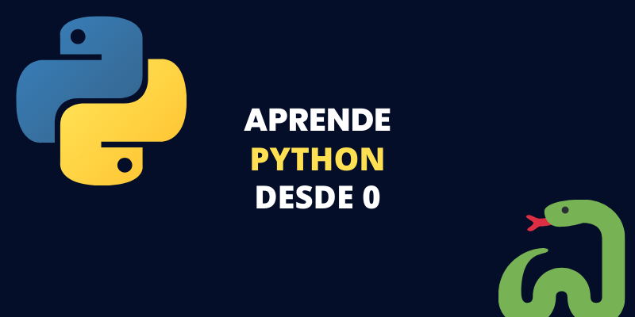

# Bienvenido al curso de Python desde cero

<b>Este curso está desarrollado en base a las clases de MoureDev</b>

---



---

## Inicio

- <b>Introducción</b>
  En python podemos escribir los comentarios haciendo uso del númeral para comentarios de una sola linea y de 3 comillas dobles al inicio y final para comentarios de varias lineas.
  ```Python
   # Este es un comentario de una linea
   """
     este es un comentario de varias lineas
   """
  ```
- <b>Mostrar algo por pantalla</b>
  Para esto hacemos uso de print
  ```Python
      print('Hola mundo desde python')
  ```
- <b>comando type()</b>
  con este comando podemos mostrar el tipo de dato que estamos usando

```Python
      print(type('Hola mundo desde python'))
      # Esto nos arrojara un str de string
```

- <b>Tipos de datos</b>
  

- <b>Variables</b>
  Las variabes se nombran unicamente con texto.
  Las variables en python se deben escribir en minúsculas o en snakecase (serpiente) de la siguiente manera.

```Python
    mi_variable = "mi primera variable"
    mi_edad = 36
```

Es importante considerar las convenciones para la declaración de variables.
[Como escribir variables en python](https://github.com/Asabeneh/30-Days-Of-Python/blob/master/02_Day_Variables_builtin_functions/02_variables_builtin_functions.md)

- <b>Inputs</b>
  nos permiten ingresar datos interactuando directamente con la consola para luego mostrarlos

```Python
    name = input('¿Cuál es tu nombre?')
    age = input('¿CUantos años tienes?')
    print(name)
    print(age)
```

- <b>Números</b>
